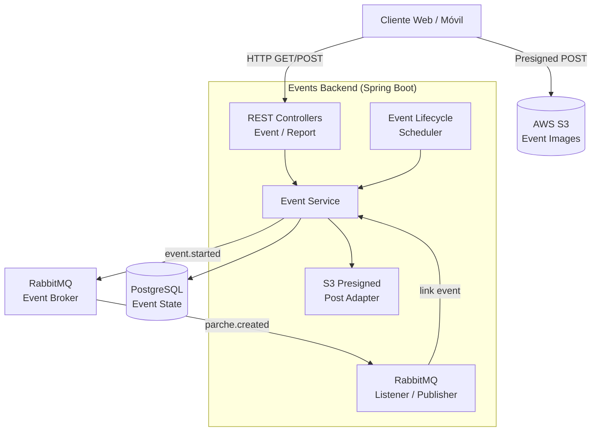
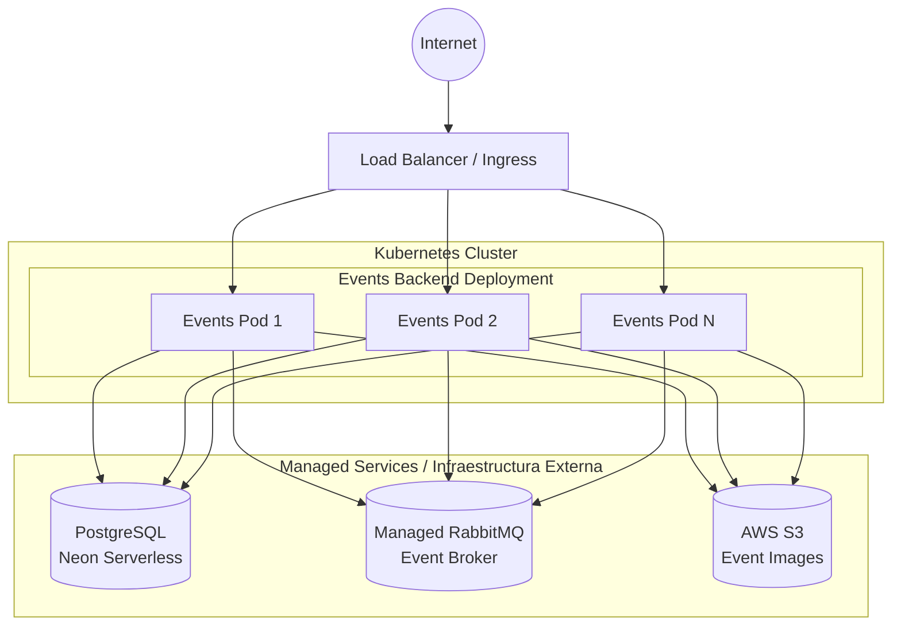

# Events Backend Microservice

Este microservicio es responsable de gestionar el ciclo de vida de los eventos dentro de la plataforma U-Link. Los eventos pueden ser independientes o estar vinculados a un parche (grupo). Maneja la creación, programación, inicio, finalización, reportes de incidentes, y carga de imágenes asociadas. Forma parte del ecosistema **PATRICIA**.

## ¿Qué hace el microservicio?

1. **Gestión del Ciclo de Vida de Eventos:** Administra el estado completo de un evento: creación, programación (con fecha/hora de inicio y fin), activación automática al inicio, y finalización. Un scheduler interno (`EventLifecycleScheduler`) gestiona las transiciones de estado.
2. **Vinculación con Parches:** Los eventos pueden asociarse a un parche específico, permitiendo que los miembros del grupo vean y se unan a los eventos del grupo.
3. **Reportes e Incidentes:** Permite a los usuarios reportar incidentes asociados a un evento, con soporte para descripción y clasificación.
4. **Carga de Imágenes:** Utiliza AWS S3 con URLs pre-firmadas (presigned POST) para permitir que los usuarios suban imágenes de eventos de forma segura directamente desde el cliente.
5. **Integración Orientada a Eventos:** Emite y escucha eventos de dominio a través de RabbitMQ (AMQP) para coordinar acciones con otros microservicios.

---

## Parámetros de Calidad y Principios de Diseño

* **Arquitectura Hexagonal (Puertos y Adaptadores):** El dominio está desacoplado de la infraestructura mediante puertos y adaptadores.
* **Principios SOLID:**
  * *Single Responsibility Principle (SRP):* Separación clara entre controladores REST (`EventController`, `ReportController`), lógica de negocio (`EventService`), y scheduler de lifecycle (`EventLifecycleScheduler`).
  * *Dependency Inversion Principle (DIP):* Inyección de dependencias a través de constructores inyectados.
* **Alta Disponibilidad y Escalabilidad Horizontal:** Diseñado stateless, escalable horizontalmente en Kubernetes.
* **Tolerancia a Fallos:** *Health Probes* (liveness, readiness) a través de Spring Boot Actuator.
* **Testing y Code Coverage:** *Coverage Gate* con JaCoCo (mínimo 80% en líneas), con tests de integración usando Testcontainers.

---

## Diagrama de Arquitectura



---

## Diagrama de Despliegue



## Tecnologías Principales

* Java 21
* Spring Boot 3.5.15
* Spring Web, Spring Data JPA
* Spring AMQP (RabbitMQ)
* Spring Boot Actuator
* PostgreSQL (Neon Serverless)
* Flyway (Migrations)
* AWS SDK v2 (S3 Presigned POST)
* Springdoc OpenAPI 2.8.16
* Testcontainers (Integration Tests)
* JaCoCo (Coverage)

## API Documentation

The service exposes a RESTful API documented via OpenAPI. Once the application is running, you can explore the API using the Swagger UI available at:
```
http://<HOST>:<PORT>/swagger-ui.html
```
The OpenAPI specification is generated automatically by Springdoc and can be accessed at `/v3/api-docs`.

## Running Locally

### Prerequisites
- Java 21 (or newer)
- Maven 3.9+
- Docker (optional, for containerized execution)
- Access to a PostgreSQL instance (local or remote)
- Access to a RabbitMQ broker (local or remote)
- AWS credentials (for S3 presigned URLs)

### Steps
1. Clone the repository and navigate to the project root.
2. Set the required environment variables (see *Configuration* section below).
3. Build the project:
   ```
   ./mvnw clean package
   ```
4. Run the application:
   ```
   java -jar target/events-0.0.1-SNAPSHOT.jar
   ```
   The service will start on port **8087** by default.

## Docker Deployment

A Dockerfile is provided for containerizing the microservice. Build and run the image with:
```bash
docker build -t events-backend:latest .

docker run -d \
  -p 8087:8087 \
  -e "SPRING_PROFILES_ACTIVE=prod" \
  -e "SPRING_DATASOURCE_URL=jdbc:postgresql://postgres:5433/events" \
  -e "SPRING_RABBITMQ_HOST=rabbitmq" \
  -e "AWS_ACCESS_KEY_ID=your-access-key" \
  -e "AWS_SECRET_ACCESS_KEY=your-secret-key" \
  -e "S3_BUCKET_NAME=your-bucket" \
  events-backend:latest
```

A `docker-compose.yml` is also provided for local development with PostgreSQL and RabbitMQ:
```bash
docker-compose up -d
```

## Configuration

The service requires the following environment variables:

| Variable | Description | Required |
|----------|-------------|----------|
| `SPRING_DATASOURCE_URL` | PostgreSQL JDBC URL | Yes |
| `SPRING_DATASOURCE_USERNAME` | PostgreSQL username | Yes |
| `SPRING_DATASOURCE_PASSWORD` | PostgreSQL password | Yes |
| `SPRING_RABBITMQ_HOST` | RabbitMQ host for domain events | Yes |
| `SPRING_RABBITMQ_USERNAME` | RabbitMQ username | Yes |
| `SPRING_RABBITMQ_PASSWORD` | RabbitMQ password | Yes |
| `AWS_ACCESS_KEY_ID` | AWS access key for S3 | Yes |
| `AWS_SECRET_ACCESS_KEY` | AWS secret key for S3 | Yes |
| `S3_BUCKET_NAME` | S3 bucket for event images | Yes |
| `S3_REGION` | AWS region for S3 | Yes |

## Testing

Unit and integration tests are located under `src/test/java`. Run the full test suite with:
```bash
./mvnw verify
```
Coverage is enforced by JaCoCo with a minimum of **80%** line coverage. Integration tests use Testcontainers for PostgreSQL.

## Contributing

Contributions are welcome! Please follow these steps:
1. Fork the repository.
2. Create a feature branch (`git checkout -b feature/awesome-feature`).
3. Implement your changes, ensuring existing tests pass and adding new tests if needed.
4. Submit a Pull Request with a clear description of the changes.

All contributions must adhere to the project's coding standards and pass the CI pipeline.

## License

This project is licensed under the **Apache License 2.0**. See the `LICENSE` file for details.
